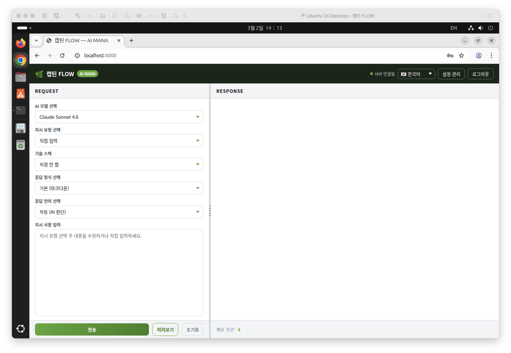
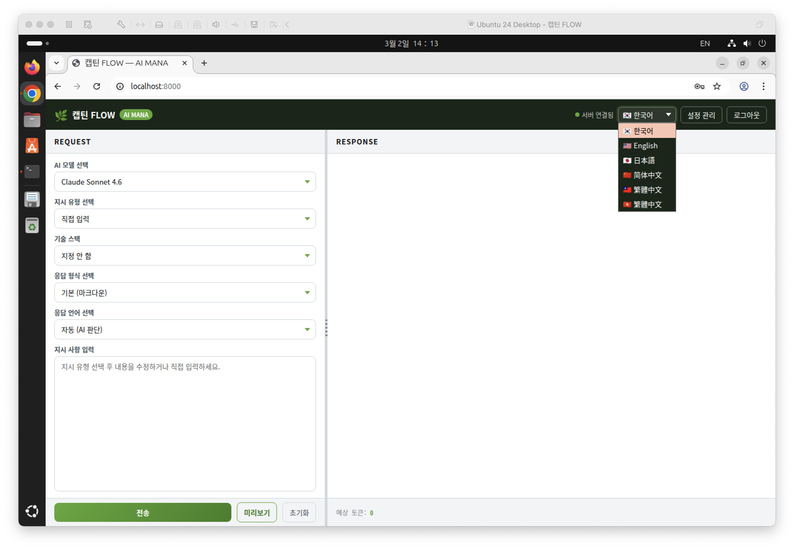
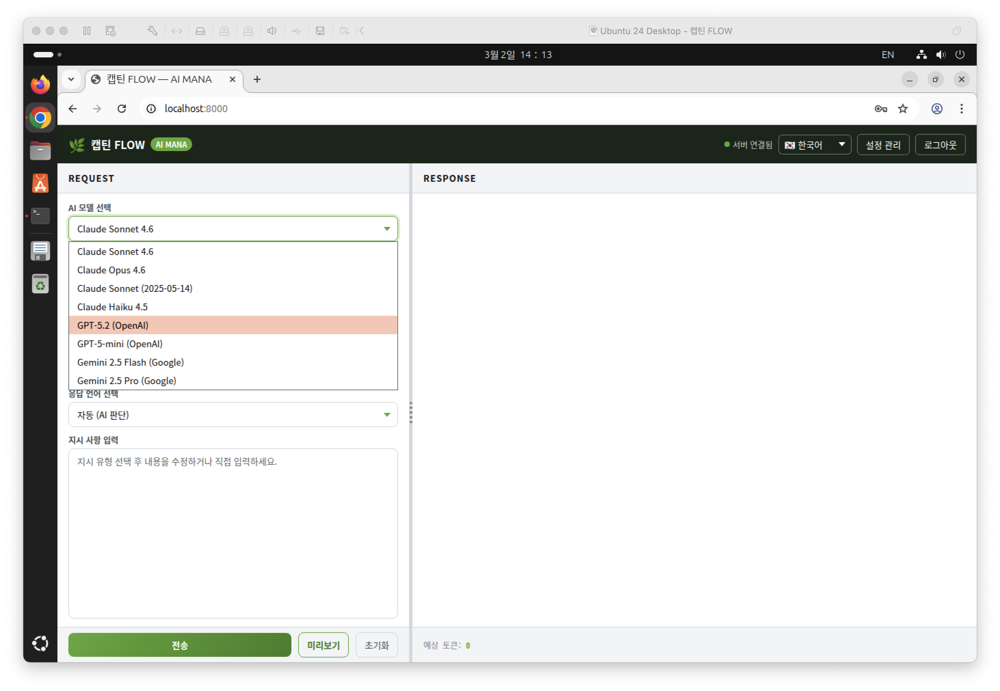
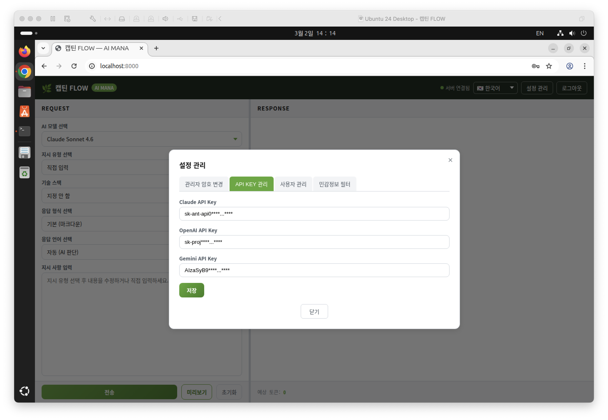
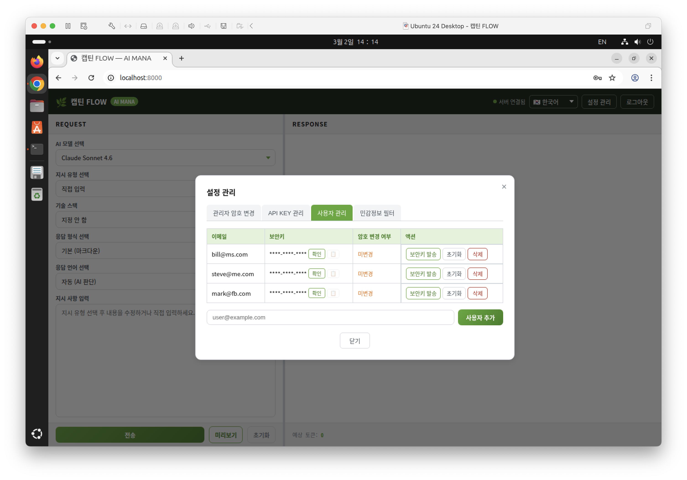
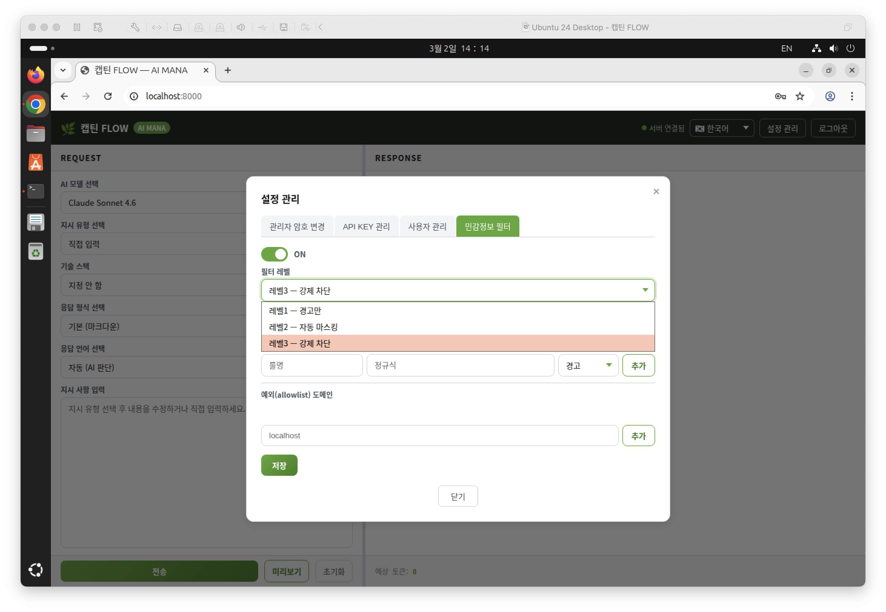
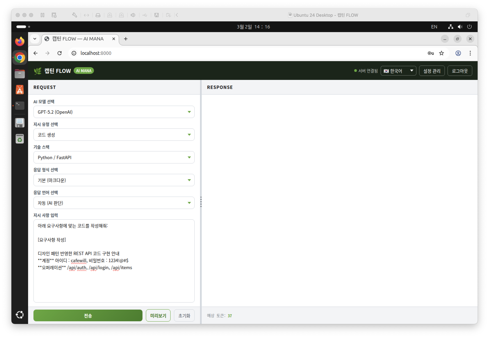
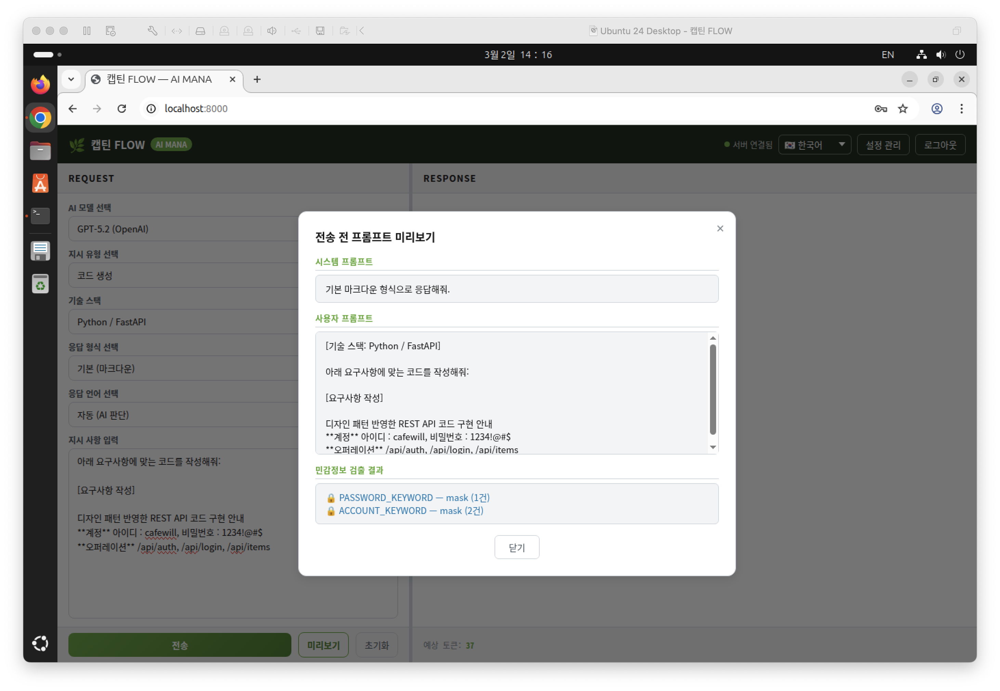
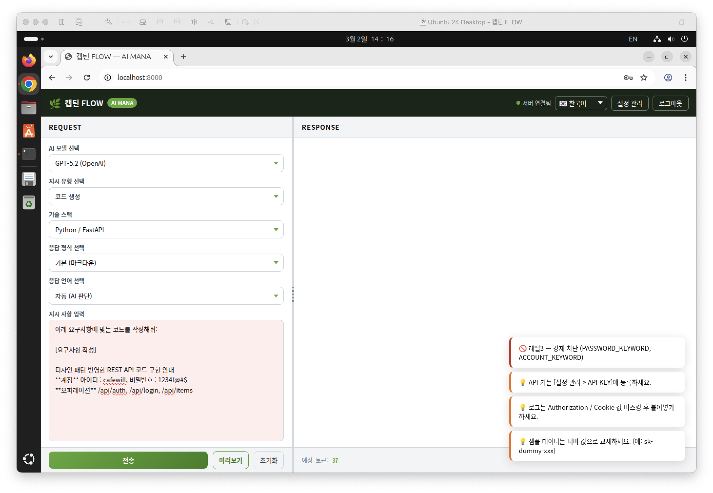
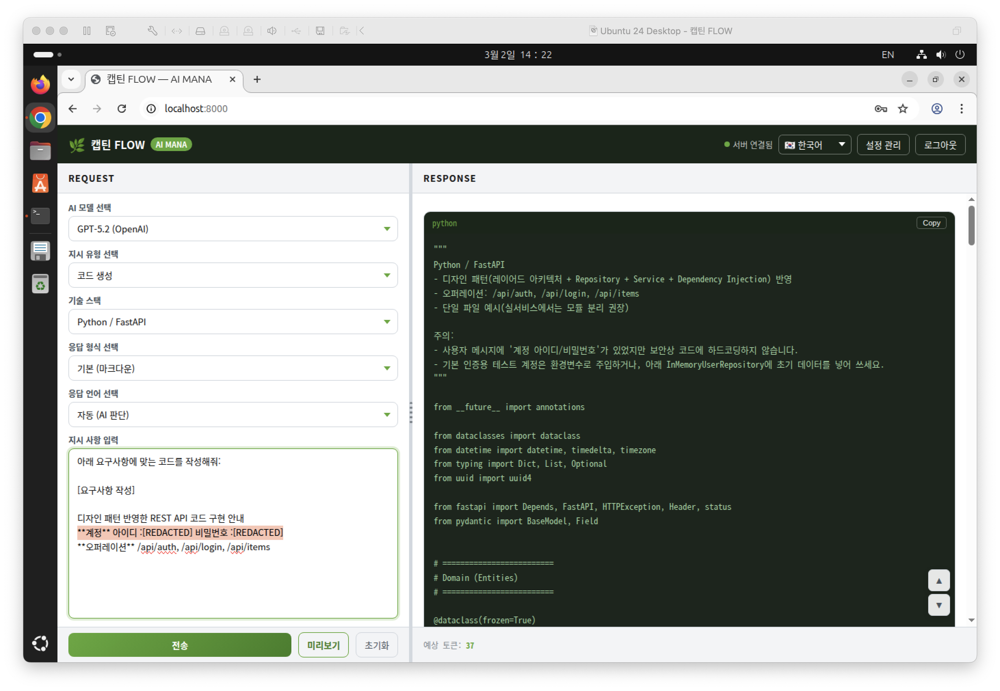

# 캡틴 FLOW

**Team collaboration for the AI era.**

AI 시대에 적합한 팀 소통 및 협업 솔루션입니다.

스타트업 환경에서는 빠른 설치·운영이 가능한 경량 도입을 지향하며, 엔터프라이즈 환경에서는 권한·보안·감사(로그) 기능 확장을 지원합니다.

---

## 핵심 특징

- **다중 AI 연동**: Claude / ChatGPT / Gemini API 연동 지원
- **단일 반응형 UI**: 외부 CDN 없이 동작하는 정적 HTML/JS 기반 UI
- **중앙화된 API Key 관리**: 모델별 API Key 등록·마스킹·관리
- **권한 분리·온보딩**: 관리자/사용자 분리 + 보안키 기반 초대·로그인
- **민감정보 필터(3단계)**
  - Level 1: 경고만 표시(전송 허용)
  - Level 2: 자동 마스킹 후 전송
  - Level 3: 강제 차단(서버 400)
- **폐쇄망·보안 환경 대응**: 외부 의존 최소화 + 민감정보 제어로 안전한 협업 지원
- **업무 템플릿 확장**: 개발뿐 아니라 기획·디자인·문서화·일반 업무 소통 템플릿으로 확장 운영 가능

---

## 기술 스택

- **Backend**: Python 3.12+, FastAPI, Uvicorn
- **Streaming**: SSE(Server-Sent Events)
- **Auth/Security**: JWT, bcrypt
- **AI SDKs**: OpenAI / Anthropic / Google Gemini
- **Frontend**: Responsive static HTML/JS (no external CDN)

> 다양한 개발·운영 환경(Python / Node.js / Spring Boot 등)에도 쉽게 확장할 수 있도록 구조화되어 있습니다.

---

## 빠른 시작

### 1) 설치
```bash
pip install -r requirements.txt
````

### 2) 환경 변수 설정

```bash
cp .env.example .env
# .env에서 HOST, PORT, SECRET_KEY 등 서버 설정을 입력합니다.
```

> ⚠️ **AI API Key는 `.env`에 저장하지 않습니다.**
> 웹 UI의 **[설정 관리 > API KEY 관리]** 화면에서 중앙 등록·마스킹·관리합니다.

### 3) 실행

```bash
python main.py
```

* 최초 실행 시 콘솔에 **관리자 보안키**가 출력됩니다.
* 접속 주소: `http://localhost:8000`
* 우측 상단 **[로그인] → admin + 보안키**로 로그인합니다.
* 로그인 후 **[설정 관리] → 관리자 암호 변경 및 API Key 등록**을 권장합니다.

---

## 민감정보 필터링

**[설정 관리] → 민감정보 필터**에서 ON/OFF 및 레벨을 설정합니다.

* Level 1: 경고만 표시(전송 허용)
* Level 2: 자동 마스킹 후 전송
* Level 3: 강제 차단(서버 400)

기본 룰셋(예: API Key, 토큰, DB 연결 문자열, 쿠키, 계정 자격증명 등)과 커스텀 룰(사내 도메인, 프로젝트 코드명 등)을 지원합니다.
감사 로그는 `data/security_events.jsonl`(메타 정보)로 기록되도록 확장할 수 있습니다.

---

## API 엔드포인트 (요약)

* `POST /api/ai/ask` : AI 지시 요청(SSE 스트리밍)
* `GET  /api/health` : 서버 상태 확인
* `POST /api/admin/login` : 관리자 로그인
* `POST /api/user/login` : 사용자 로그인
* `POST /api/admin/change-password` : 관리자 암호 변경
* `POST /api/user/change-password` : 사용자 암호 설정
* `GET/POST /api/admin/apikeys` : API Key 조회/저장
* `GET/POST /api/admin/filter` : 민감정보 필터 설정 조회/저장
* `GET/POST /api/admin/users` : 사용자 목록 조회/추가
* `DELETE /api/admin/users/{email}` : 사용자 삭제
* `POST /api/admin/users/{email}/reset` : 사용자 비밀번호 초기화(보안키 재발급 준비)
* `POST /api/admin/users/{email}/send-key` : 보안키 이메일 발송
* `GET  /api/admin/users/{email}/security-key` : 평문 보안키 조회(미변경 상태만)

---

## 프로젝트 구조

```text
.
├─ main.py
├─ requirements.txt
├─ .env.example
├─ routers/         # API 라우터
├─ services/        # 비즈니스 로직
├─ models/          # Pydantic 모델 등
├─ config/          # 설정/상수/유틸
├─ static/          # 단일 UI 정적 리소스(HTML/JS/CSS)
└─ data/            # 런타임 저장소(설정/로그 등) — Git에 커밋하지 않음
```

---

## AI API Key 생성 가이드 (참고)

각 플랫폼에서 API Key를 발급할 수 있습니다.

* OpenAI  : [https://platform.openai.com](https://platform.openai.com) / [https://platform.openai.com/api-keys](https://platform.openai.com/api-keys)
* Claude  : [https://platform.claude.com](https://platform.claude.com) / [https://platform.claude.com/settings/keys](https://platform.claude.com/settings/keys)
* Gemini  : [https://aistudio.google.com](https://aistudio.google.com) / [https://aistudio.google.com/app/apikey](https://aistudio.google.com/app/apikey)

---

## 보안 권장 사항

* `.env` 및 `data/` 하위 런타임 파일(설정/로그/키)은 **Git에 커밋하지 않습니다.**
* 운영 환경에서는 `SECRET_KEY`를 충분히 긴 랜덤 문자열로 설정합니다.
* 민감정보 필터는 **Level 2 이상**을 기본으로 운영하고, 폐쇄망·보안망에서는 **Level 3** 정책을 권장합니다(조직 정책에 따름).
* 민감정보 필터링은 **패턴 매칭 기반** 최소한의 방어 기능이며 사용자가 민감정보 유출 방지 수칙을 우선 준수하는 것을 권장합니다.

### AI 활용 시 민감정보 유출 방지 수칙

* 프롬프트/첨부파일에 **개인정보·인증정보(비밀번호/토큰/API Key/쿠키)·계정/결제정보**를 입력하지 않습니다.
* 로그/에러/DB 덤프/스크린샷 공유 전, **식별자(이메일/전화/주민번호/주소) 및 키·토큰**을 마스킹합니다.
* 실제 데이터 대신 **샘플 데이터/가명 처리 데이터**로 대체하고, 불가피 시 **최소 범위**만 제공합니다.
* 내부 코드/문서 공유 시 **비공개 저장소/권한 최소화/기간 제한 링크** 등 조직 보안 정책을 준수합니다.
* 생성된 결과물은 그대로 배포하지 말고 **재검토(보안·권한·비밀값 포함 여부)** 후 반영합니다.  
  - 예: **[SonarCloud](https://www.sonarsource.com)**(정적 분석/보안 점검)로 PR/빌드 단계에서 자동 검증 후 머지·배포를 권장합니다.

---

## 스크린샷

> 아래 스크린샷은 **Captain FLOW**의 주요 화면 흐름과 설정 기능을 순서대로 보여줍니다.

### 메인 화면

* 서비스 진입 후 기본 홈 화면입니다.
  

### 메인 화면 > 다국어 언어 선택

* 상단 언어 선택 메뉴에서 UI 언어를 전환합니다.
  

### 메인 화면 > AI 모델 선택

* 사용 목적에 맞는 AI 모델을 선택하여 요청/응답을 제어합니다.
  

### 설정 관리 > API KEY 관리

* 외부 연동을 위한 API Key를 등록·관리합니다.
  

### 설정 관리 > 사용자 관리

* 사용자 계정 및 권한(역할) 기반 접근을 관리합니다.
  

### 설정 관리 > 민감정보 필터링 관리

* 입력/출력의 민감정보 탐지 및 처리 정책(경고/마스킹/차단)을 설정합니다.
  

### 설정 관리 > 지시사항 입력

* 요청에 사용할 지시사항(프롬프트)을 입력·관리합니다.
  

### 설정 관리 > 지시사항 입력 미리보기 (민감정보 체크 예시)

* 입력 내용에서 민감정보 감지 여부를 미리 확인합니다.
  

### 설정 관리 > 지시사항 입력 미리보기 (설정에 따른 민감정보 차단 예시)

* 정책이 “차단”인 경우, 민감정보 포함 요청을 자동으로 제한합니다.
  

### 설정 관리 > 지시사항 실행하기 (설정에 따른 민감정보 자동 마스킹 연동 예시)

* 정책이 “마스킹”인 경우, 민감정보를 자동으로 비식별 처리하여 반영합니다.
  
